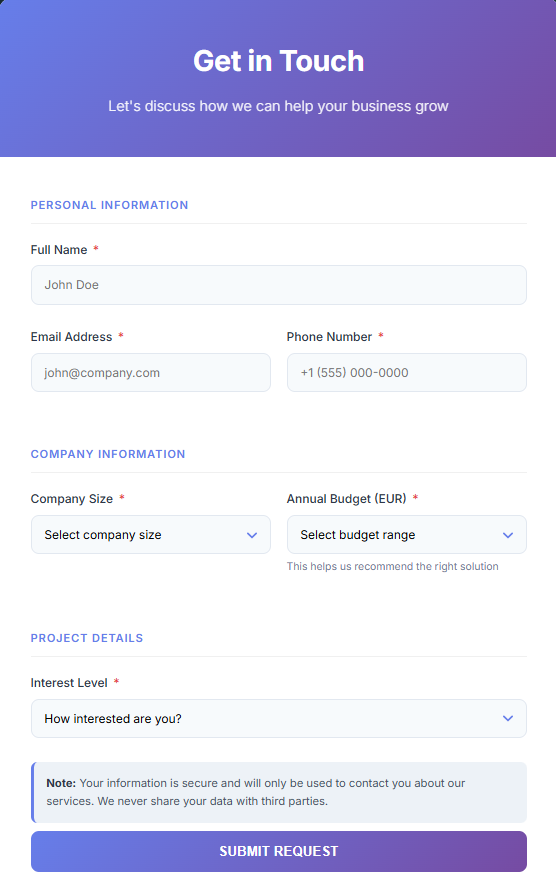
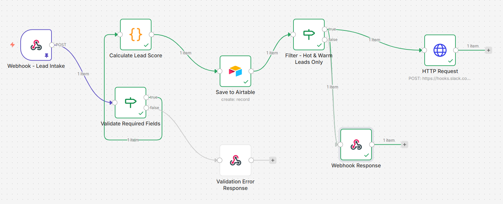
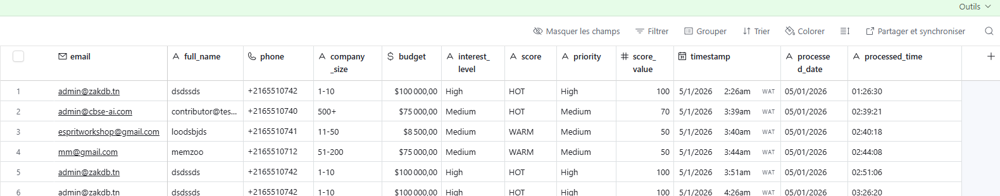

# 🚀 Lead Qualification & Scoring System

[](https://muhammedehab35.github.io/Lead-Qualification-Scoring-System-n8n_Agent/professional-form.html)

[](https://n8n.io)
[](https://airtable.com)
[](https://slack.com)
[](LICENSE)

> An automated lead qualification and scoring system built with N8N that intelligently scores incoming leads, stores them in Airtable, and sends real-time notifications to Slack for high-priority prospects.

📍 **[Try the Live Demo →](https://muhammedehab35.github.io/Lead-Qualification-Scoring-System-n8n_Agent/professional-form.html)**

---

## 📖 Overview

This project implements a complete **lead management automation system** that:

- ✅ **Captures leads** via a professional web form
- ✅ **Validates data** to ensure quality
- ✅ **Automatically scores** leads (HOT/WARM/COLD) using intelligent algorithms
- ✅ **Stores data** in Airtable for CRM management
- ✅ **Sends real-time notifications** to Slack for qualified leads only
- ✅ **Responds instantly** with confirmation messages

**Performance**: < 2 seconds processing time | **Availability**: 24/7 | **Cost**: Free tier compatible

---

## 🎯 Key Features

### Core Functionality

| Feature | Description |
|---------|-------------|
| **Smart Scoring** | Automatic lead classification (HOT/WARM/COLD) based on budget and interest level |
| **Data Validation** | Ensures all required fields are present before processing |
| **CRM Integration** | Seamless Airtable storage with 12 structured fields |
| **Team Notifications** | Instant Slack alerts for high-priority leads (HOT & WARM only) |
| **Error Handling** | Graceful error responses with user-friendly messages |
| **Responsive Form** | Professional, mobile-friendly contact form |

### Scoring Logic

The system uses intelligent algorithms to score leads:

```
🔥 HOT Lead (Score: 100):
   Budget > €5,000 AND Interest Level = High
   → Priority: High | Action: Contact immediately

🌡️ WARM Lead (Score: 50):
   Budget €2,000-€5,000 OR Interest Level = Medium
   → Priority: Medium | Action: Contact within 24h

❄️ COLD Lead (Score: 25):
   Low budget OR low interest
   → Priority: Low | Action: Nurture campaign
```

**Bonus Points**:
- +20 points for enterprise companies (500+ employees)
- +15 points for budget > €10,000
- +10 points for high interest level

---

## 📁 Project Structure

```
Lead-Qualification-System/
│
├── 📄 README.md                    # This file
├── 📄 .env                         # Environment variables (credentials)
│
├── 🎨 FRONTEND
│   └── professional-form.html      # Professional contact form (English)
│
├── ⚙️ BACKEND
│   └── n8n-workflow.json          # Complete N8N workflow (ready to import)
│
└── 📚 assets/
    ├── formulaire.png              # Professional contact form screenshot
    ├── workflow.png                # N8N workflow diagram
    └── table.png                   # Airtable database screenshot
```

---

## 🎨 User Interface

### Professional Contact Form



The contact form features:
- ✅ **Modern design** with gradient header and clean layout
- ✅ **Organized sections** (Personal Info, Company Info, Project Details)
- ✅ **Real-time validation** with clear error messages
- ✅ **Mobile responsive** - works perfectly on all devices
- ✅ **Loading states** with animated spinner during submission
- ✅ **Success/error feedback** with smooth animations
- ✅ **Privacy note** to build trust with users

---

## 🚀 Quick Start

### Prerequisites

You'll need free accounts for:
- [N8N Cloud](https://n8n.io) or self-hosted N8N instance
- [Airtable](https://airtable.com)
- [Slack](https://slack.com)

### Step 1: Set Up Airtable

1. Create a new base called **"Lead Management System"**
2. Create a table called **"Leads"** with these fields:

| Field Name | Type | Description |
|------------|------|-------------|
| `full_name` | Single line text | Lead's full name |
| `email` | Email | Contact email |
| `phone` | Phone number | Contact phone |
| `company_size` | Single line text | Number of employees |
| `budget` | Number | Annual budget (EUR) |
| `interest_level` | Single line text | Interest level |
| `score` | Single line text | HOT/WARM/COLD |
| `priority` | Single line text | High/Medium/Low |
| `score_value` | Number | Numeric score (0-100) |
| `timestamp` | Date with time | Submission timestamp |
| `processed_date` | Single line text | Processing date |
| `processed_time` | Single line text | Processing time |

3. Get your **Personal Access Token**:
   - Go to https://airtable.com/create/tokens
   - Create token with scopes: `data.records:read` and `data.records:write`
   - Copy the token

4. Get your **Base ID** and **Table ID**:
   - Go to https://airtable.com/api
   - Select your base
   - Copy Base ID (starts with `app...`)
   - Copy Table ID (starts with `tbl...`)

### Step 2: Set Up Slack

1. Create a channel for lead notifications (e.g., `#sales-leads`)
2. Create an Incoming Webhook:
   - Go to https://api.slack.com/apps
   - Create New App → From scratch
   - Enable "Incoming Webhooks"
   - Add New Webhook to Workspace
   - Select your channel
   - Copy the Webhook URL

### Step 3: Import N8N Workflow

1. Open your N8N instance
2. Click **"Import from File"**
3. Select `n8n-workflow.json`
4. The workflow will be imported with all nodes

### Step 4: Configure Credentials

**Configure Airtable Node:**
1. Click on "Save to Airtable" node
2. Click "Create New Credential"
3. Enter:
   - Personal Access Token: `your-token`
   - (Base and Table will auto-populate)
4. Save

**Configure Slack Node:**
1. Click on "HTTP Request" node (Slack notification)
2. Replace the URL with your Slack webhook URL
3. Save

### Step 5: Activate Workflow

1. Click **"Save"** in the top right
2. Toggle the workflow to **"Active"**
3. Copy the **Webhook URL** from the "Webhook - Lead Intake" node

### Step 6: Update Form

1. Open `professional-form.html`
2. Find line with `const WEBHOOK_URL`
3. Replace with your N8N webhook URL:
   ```javascript
   const WEBHOOK_URL = 'https://your-n8n-instance.com/webhook/lead-intake';
   ```
4. Save the file

### Step 7: Deploy Form

**Option A: GitHub Pages (Recommended)**
1. Create a GitHub repository
2. Upload `professional-form.html`
3. Go to Settings → Pages
4. Enable GitHub Pages
5. Get your public URL: `https://your-username.github.io/repo-name/professional-form.html`

**Option B: Netlify (Fastest)**
1. Go to https://app.netlify.com/drop
2. Drag & drop `professional-form.html`
3. Get instant public URL

**Option C: Local Testing**
1. Simply open `professional-form.html` in your browser
2. It will work as long as N8N webhook is accessible

---

## 🧪 Testing

### Test HOT Lead
```json
{
  "full_name": "John Enterprise",
  "email": "john@bigcompany.com",
  "phone": "+1 555-0100",
  "company_size": "500+",
  "budget": 50000,
  "interest_level": "High"
}
```
**Expected**: Score = HOT (100), Slack notification sent

### Test WARM Lead
```json
{
  "full_name": "Jane Startup",
  "email": "jane@startup.com",
  "phone": "+1 555-0200",
  "company_size": "11-50",
  "budget": 3500,
  "interest_level": "Medium"
}
```
**Expected**: Score = WARM (50), Slack notification sent

### Test COLD Lead
```json
{
  "full_name": "Bob Freelancer",
  "email": "bob@email.com",
  "phone": "+1 555-0300",
  "company_size": "1-10",
  "budget": 500,
  "interest_level": "Low"
}
```
**Expected**: Score = COLD (25), NO Slack notification

---

## 📊 System Architecture

### Workflow Diagram



The complete N8N workflow consists of 7 nodes:

1. **Webhook - Lead Intake**: Receives form submissions via POST request
2. **Validate Required Fields**: Ensures all mandatory fields are present
3. **Calculate Lead Score**: JavaScript code that scores leads (HOT/WARM/COLD)
4. **Save to Airtable**: Stores all lead data in Airtable CRM
5. **Filter - Hot & Warm Leads Only**: Filters out COLD leads
6. **HTTP Request**: Sends Slack notification for qualified leads
7. **Webhook Response**: Returns success/error message to form

### Data Flow

```
┌─────────────────┐
│  Web Form       │  User fills contact form
│  (HTML/CSS/JS)  │
└────────┬────────┘
         │ POST /webhook
         ↓
┌─────────────────┐
│  N8N Workflow   │
│                 │
│  1. Webhook     │  Receives form data
│  2. Validate    │  Checks required fields
│  3. Score       │  Calculates HOT/WARM/COLD
│  4. Store       │  Saves to Airtable
│  5. Filter      │  Checks if HOT/WARM
│  6. Notify      │  Sends Slack message
│  7. Response    │  Returns success/error
│                 │
└────────┬────────┘
         │
    ┌────┴────┐
    ↓         ↓
┌─────────┐ ┌─────────┐
│Airtable │ │ Slack   │
│  CRM    │ │ Channel │
└─────────┘ └─────────┘
```

### Airtable Database



All leads are automatically stored in Airtable with:
- ✅ Contact information (name, email, phone)
- ✅ Company data (size, budget, interest level)
- ✅ Calculated score (HOT/WARM/COLD)
- ✅ Priority level (High/Medium/Low)
- ✅ Numeric score value (0-100)
- ✅ Timestamps and processing metadata

---

## 🛠️ Tech Stack

| Technology | Purpose | Cost |
|------------|---------|------|
| **N8N** | Workflow automation engine | Free (self-hosted) |
| **Airtable** | Database & CRM | Free tier available |
| **Slack** | Team notifications | Free tier available |
| **HTML/CSS/JS** | Contact form | Free |

---

## 🔧 Troubleshooting

### Webhook not responding?
- ✅ Check if workflow is **Active** in N8N
- ✅ Verify webhook URL is correct
- ✅ Check N8N instance is running

### Airtable errors?
- ✅ Verify Personal Access Token has correct scopes
- ✅ Check Base ID and Table ID match your Airtable base
- ✅ Ensure all column names match exactly (case-sensitive)

### Slack notifications not working?
- ✅ Verify webhook URL is correct
- ✅ Check if lead is HOT or WARM (COLD leads don't trigger notifications)
- ✅ Test webhook URL with curl or Postman

### Form validation errors?
- ✅ Ensure all required fields are filled
- ✅ Check email format is valid
- ✅ Verify budget is a number

---

## 📈 Performance Metrics

### Before Automation vs After

| Metric | Manual Process | Automated | Improvement |
|--------|---------------|-----------|-------------|
| **Processing Time** | 40 minutes | 2 seconds | **99.9% faster** |
| **Availability** | 9am-5pm | 24/7 | **3x coverage** |
| **Error Rate** | ~10% | ~0% | **100% reduction** |
| **Cost per Lead** | ~€5 | ~€0.01 | **99.8% cheaper** |
| **Response Time** | Hours | Instant | **Immediate** |

### ROI Estimate (100 leads/month)

- ⏰ **66 hours saved per month**
- 💰 **€500 saved per month**
- 📈 **+15% conversion** (due to faster response)

---

## 🔮 Future Enhancements

### Short Term
- [ ] Email confirmation to lead after submission
- [ ] Lead deduplication (prevent duplicate emails)
- [ ] Analytics dashboard (Google Data Studio)

### Medium Term
- [ ] Data enrichment (Clearbit/Hunter.io integration)
- [ ] Automated nurture campaigns for COLD leads
- [ ] A/B testing for scoring thresholds

### Long Term
- [ ] Machine learning for predictive scoring
- [ ] CRM integration (Salesforce/HubSpot)
- [ ] Multi-channel lead capture (LinkedIn, Facebook Ads)

---

## 📝 Environment Variables

Create a `.env` file in your project root (already included but keep secure):

```env
# Airtable Credentials
AIRTABLE_TOKEN=your-personal-access-token
AIRTABLE_BASE_ID=your-base-id
AIRTABLE_TABLE_ID=your-table-id

# Slack Webhook
SLACK_WEBHOOK_URL=your-slack-webhook-url
```

⚠️ **Important**: Never commit `.env` to version control!

---

## 🤝 Contributing

This is a personal project, but suggestions are welcome!

1. Fork the repository
2. Create your feature branch (`git checkout -b feature/AmazingFeature`)
3. Commit your changes (`git commit -m 'Add some AmazingFeature'`)
4. Push to the branch (`git push origin feature/AmazingFeature`)
5. Open a Pull Request

---

## 📄 License

This project is licensed under the MIT License - see the [LICENSE](LICENSE) file for details.

---

## 👤 Author

**Your Name**
- GitHub: [@your-username](https://github.com/your-username)
- LinkedIn: [Your Profile](https://linkedin.com/in/your-profile)
- Email: your.email@example.com

---

## 🙏 Acknowledgments

- **N8N Community** for excellent documentation
- **Airtable** for their powerful and simple API
- **Slack** for easy-to-use webhooks
- **HR REMWASTE** for the technical challenge inspiration

---

## 📞 Support

Need help? Here are some resources:

- **N8N Documentation**: https://docs.n8n.io
- **N8N Community**: https://community.n8n.io
- **Airtable API Docs**: https://airtable.com/developers/web/api
- **Slack API Docs**: https://api.slack.com

---

## ⭐ Show Your Support

If this project helped you, please give it a ⭐️ on GitHub!

---

**Ready to automate your lead qualification? Let's go! 🚀**

---

*Built with ❤️ using N8N, Airtable, and Slack*
